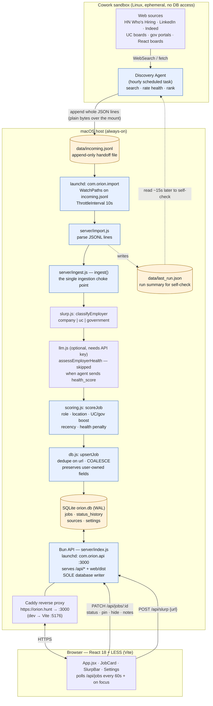
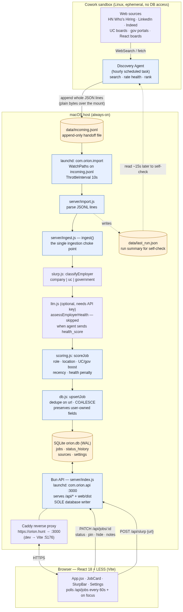
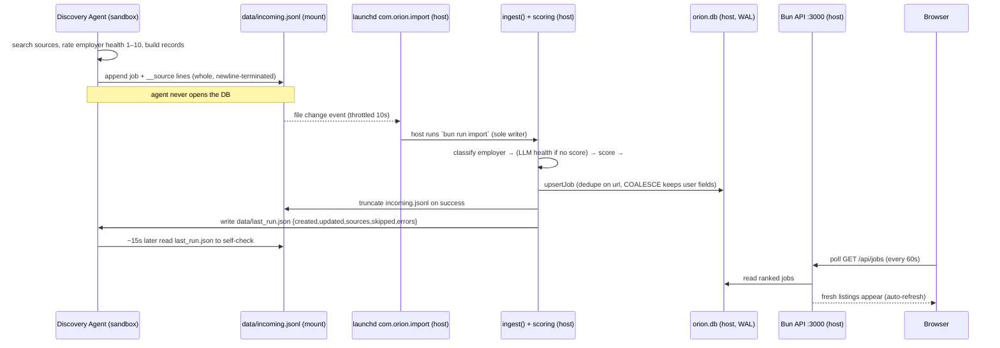

# Orion — Architecture

Orion is a local-first "one-stop job-getting machine." It keeps a permanent SQLite
record of every job listing ever discovered, tracks each one through an application
pipeline, and is continuously fed by an autonomous hourly discovery agent. This
document describes how the whole stack fits together.

The design has one load-bearing principle: **exactly one process ever writes the
database.** The always-on host API owns `orion.db`. The discovery agent — which runs
in an isolated sandbox on the other side of a filesystem mount — never opens the DB;
it only appends a flat text file, and a host-side watcher does the import. This avoids
cross-kernel SQLite/WAL corruption while still letting an untrusted, ephemeral agent
feed the system.

## The stack at a glance

> Rendered view (for clients that don't render Mermaid):
>
> 

## The hourly cycle

## Components

### Processes (all host-side)

*(`com.orion.api` and Caddy are always-on; `com.orion.import` is a one-shot that fires
on each `incoming.jsonl` change, not KeepAlive.)*

| Process | What it does |
|---|---|
| **`com.orion.api`** (launchd) | The Bun server (`server/index.js`) on `:3000`. Serves the JSON API under `/api/*` and the built frontend from `web/dist`. **The only process that opens `orion.db`.** Starts at login, KeepAlive/auto-restart. |
| **`com.orion.import`** (launchd) | A `WatchPaths` agent on `data/incoming.jsonl`. On change it runs `bun run import` host-side (`ThrottleInterval` 10s coalesces bursts). This is what lets the sandboxed agent feed the DB without ever touching it. |
| **Caddy** | Reverse proxy giving Orion a friendly local HTTPS host, `https://orion.hunt` → `:3000` in prod (→ Vite `:5176` in dev). Uses `tls internal` (local CA) since `orion.hunt` isn't a public domain. |

### Server modules (`server/`)

| Module | Responsibility |
|---|---|
| `index.js` | Bun.serve HTTP API + static `web/dist` host. Routes below. |
| `ingest.js` | `ingest()` — the **single ingestion choke point**: classify employer → optional LLM health → score → upsert. Everything (file import, `/api/ingest`, manual add, slurp) flows through it so ranking is consistent. |
| `import.js` | Reads `data/incoming.jsonl`, ingests each line, records `__source` rows, truncates the file, writes `data/last_run.json`. |
| `db.js` | `bun:sqlite` schema + `upsertJob` (dedupe on `url`, `COALESCE` preserves user-owned fields), `status_history`, `sources`, `settings`. `PRAGMA busy_timeout = 5000`. |
| `scoring.js` | Transparent rule-based `scoreJob` (role match, location/remote fit, UC/gov boosts, recency, health penalty: `concern` −25, `excluded` −100). Orion **always** re-scores; the agent never sends a score. |
| `slurp.js` | `parseJobFromHtml` (schema.org JobPosting JSON-LD → Open Graph → meta) and `classifyEmployer`. |
| `llm.js` | Optional Claude calls — `extractJobWithLLM`, `assessEmployerHealth`. Skipped when the agent already supplied `health_score`. Degrades gracefully with no API key. |

### API endpoints (`server/index.js`)

| Method | Path | Purpose |
|---|---|---|
| GET | `/api/jobs?includeHidden=&status=` | Ranked list (pinned → active → score). |
| GET | `/api/jobs/:id` | Job + status history. |
| PATCH/PUT | `/api/jobs/:id` | Update user-owned fields (status, hidden, pinned, notes). |
| POST | `/api/jobs` | Manual add (re-scores + upserts). |
| POST | `/api/ingest` | Batch ingest a whole agent run over HTTP (single-writer alternative to the file path; unused by the sandbox agent, which can't reach host loopback). |
| POST | `/api/jobs/:id/health` | Recompute employer health for that company. |
| POST | `/api/slurp` `{url}` | Fetch + parse + score + store a pasted posting. |
| GET/POST | `/api/sources` | List / record discovery sources. |
| GET | `/api/stats` | Totals by status. |
| GET/PUT | `/api/settings` | Read / patch the full search/scoring/agent config. |

### Frontend (`web/`, React 18 + LESS via Vite)

`App.jsx` (pipeline view: slurp bar, stats, status filters, ranked `JobCard` list),
`JobCard` (score + reasons, status dropdown, pin/hide, notes), `SlurpBar`,
`Settings.jsx` (edits the config). LESS is bundled by Vite; no `.less` imports beyond
`main.jsx`. The open page polls `/api/jobs` every 60s and on tab-focus, so the agent's
hourly finds appear without a manual reload. In prod the Bun API serves the prebuilt
`web/dist`, so a change to `web/src` requires `bun run build` to show up.

## Data model (`orion.db`)

**jobs** — one row per listing; `dedupe_key` (canonical `url`) is the upsert key.
Listing/scoring fields (`title`, `company`, `location`, `work_mode`, `salary`,
`description`, `source`, `employer_type`, `score`, `score_reasons`, `health_flag`,
`health_score`, `health_notes`, `fit_summary`, `posted_at`) are refreshed every run.
**User-owned fields (`status`, `hidden`, `pinned`, `notes`) are never overwritten** —
`upsertJob` uses `COALESCE`, so the hourly agent keeps data fresh without clobbering
Andrew's progress. **status_history** is an append-only timeline of pipeline changes.
**sources** holds known + newly discovered boards. **settings** is a key/value JSON
config store.

## The discovery agent ↔ Orion contract

The agent runs as a Cowork **scheduled task** (`frontend-react-job-tracker`, hourly),
fresh with no memory each run. It and Orion's maintainer (Claude Code) coordinate
through files in this repo:

- **`AGENT_CONTRACT.md`** — the authoritative, versioned data contract: the JSON record
  schema, field ownership (the agent owns `health_score` 1–10; Orion owns `score`), and
  the rule that **`url` is required and is the stable dedupe key** (synthesize a
  deterministic `hn://<company>/<slug>` when a source has none).
- **`AGENT_LOG.md`** (agent → Orion) and **`ORION_LOG.md`** (Orion → agent) — two
  directional logs so neither side's writes trip the other's file-watcher.

**Agent workflow:** search → rate employer health → **append** newline-terminated
records to `data/incoming.jsonl` → read `data/last_run.json` to self-check. It never
runs the importer and never opens the database.

## Key architectural decisions

1. **Single writer.** Only host-side processes (the always-on API and the one-shot
   import) touch `orion.db`.
   The sandboxed agent cannot reach the host API over the network and must not open the
   DB file across the mount (incoherent WAL `-shm`/locks risk corruption), so it is a
   pure file producer.
2. **Append-only handoff.** `data/incoming.jsonl` is a flat text channel; a host
   `launchd WatchPaths` agent triggers the import. Plain bytes over the mount, zero
   SQLite from the sandbox.
3. **Lossless upsert.** Refreshes update listing/scoring fields but `COALESCE`-preserve
   user-owned fields. Nothing discovered is ever deleted.
4. **URL-based dedupe.** The canonical `url` is the key (not company+title hashing,
   which collided on near-identical titles). Same job → same url → refresh in place.
5. **Orion always re-scores.** Scoring is centralized and transparent (`score_reasons`),
   independent of source; the agent supplies only facts + a health rating.
6. **Graceful LLM degradation.** Claude calls are optional enrichment; heuristics carry
   the load without an API key, and the agent's pre-rated `health_score` skips the call.
